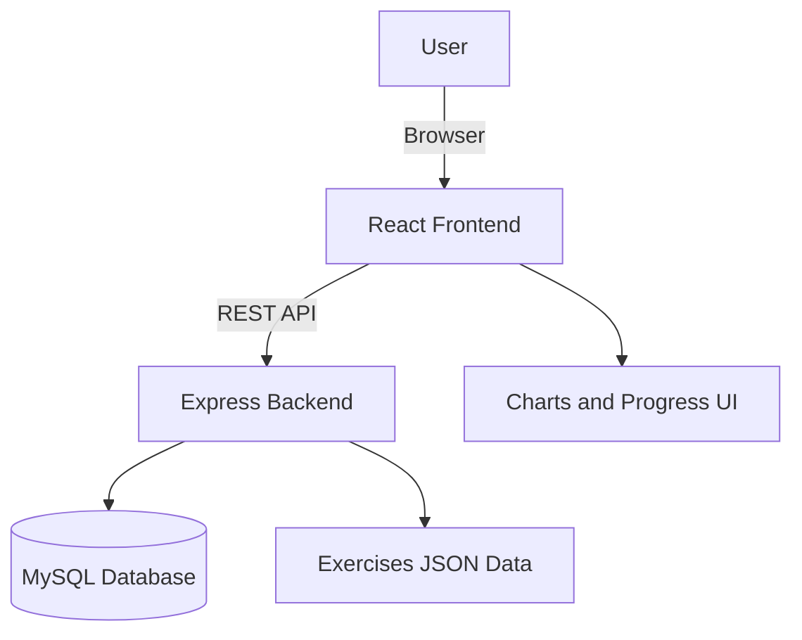
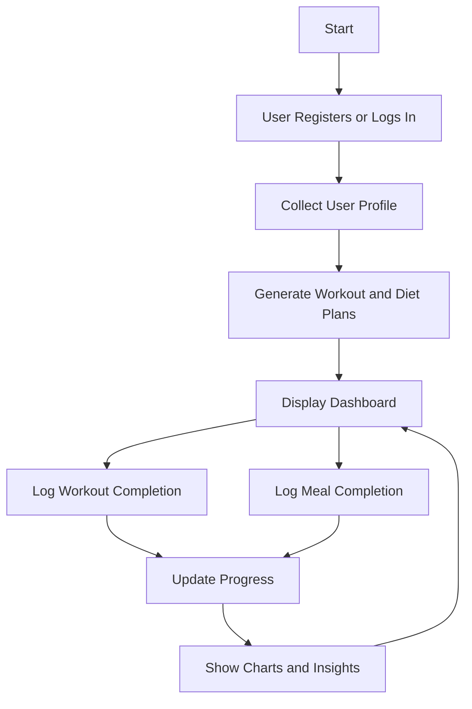

# FitPlan AI

FitPlan AI is a rule-based fitness and diet planner that delivers an AI-like personalized experience. It generates 10-week workout and nutrition plans, tracks daily completion, and supports cuisine and health modifiers. The project includes a React frontend and a Node.js/Express backend with a MySQL database.

## Problem Statement

Many users struggle to build consistent fitness and nutrition routines because existing tools are either too complex, expensive, or require long onboarding. The goal is to deliver a simple system that generates personalized plans, tracks progress, and adapts to user preferences without heavy friction.

## Project Abstract

FitPlan AI provides a rule-based personalization engine that converts user inputs into structured 10-week workout and diet plans. The system combines a React-based UI, an Express API, and a MySQL database for persistence. Users can register, receive personalized plans, log daily activity and meals, and visualize progress using charts.

## Objectives

- Generate personalized fitness and diet plans with weekly progression.
- Support dietary preferences, restrictions, and health conditions.
- Track workouts and meals with daily completion logs.
- Provide progress visualization for motivation and feedback.

## Features

- Personalized 10-week workout and diet plans
- Progressive training intensity by week
- Diet plans tailored to goals, cuisines, and restrictions
- Daily workout and meal completion tracking
- Progress dashboards with charting
- Responsive UI with light/dark theme support

## Tech Stack

- Frontend: React 18, Vite, React Router, Chart.js
- Backend: Node.js, Express, MySQL2, JWT
- Styling: CSS with custom properties

## Tools Used

- Visual Studio Code
- Node.js and npm
- Vite dev server
- MySQL
- Git

## Skills Used

- React component design and state management
- REST API design with Express
- Database schema design and SQL
- Authentication and secure storage (JWT)
- Data modeling for workouts and diets
- UI theming and responsive styling

## Monorepo Structure

```
Fitness-Plan-AI/
├── Backend/                 # Node/Express API and DB integration
│   ├── db.js                # MySQL connection pool
│   ├── schema.sql           # DB schema
│   ├── server.js            # Express app
│   └── routes/              # API routes
├── Frontend/                # React client
│   ├── src/
│   │   ├── components/      # Reusable UI components
│   │   ├── context/         # React context and state
│   │   ├── data/            # Rules and diet/workout data
│   │   ├── pages/           # App pages
│   │   ├── App.jsx          # App shell and routes
│   │   └── main.jsx         # Entry point
│   ├── index.html
│   └── package.json
├── exercises/               # Exercise metadata JSON files
└── README.md
```

## Prerequisites

- Node.js 16+ and npm
- MySQL 8+ (local or remote)

## Setup

### 1) Backend

1. Create a database and tables using [Backend/schema.sql](Backend/schema.sql).
2. In Backend, install dependencies:

```bash
cd Backend
npm install
```

3. Create a `.env` file in Backend:

```
DB_HOST=127.0.0.1
DB_USER=root
DB_PASSWORD=your_password
DB_NAME=fitness_db
PORT=5000
JWT_SECRET=your_secret
```

4. Start the API server:

```bash
npm start
```

### 2) Frontend

1. In Frontend, install dependencies:

```bash
cd Frontend
npm install
```

2. Start the Vite dev server:

```bash
npm run dev
```

3. Open `http://localhost:5173` in your browser.

## Usage Notes

- The API listens on `http://localhost:5000` by default.
- The frontend expects the backend to be running for auth, logs, and exercise lookups.
- Exercise details are served from the [exercises](exercises/) directory.

## Key Data Files

- Diet templates: [Frontend/src/data/diets.json](Frontend/src/data/diets.json)
- Workout templates: [Frontend/src/data/workouts.json](Frontend/src/data/workouts.json)
- Rule engine: [Frontend/src/data/rules.json](Frontend/src/data/rules.json)

## Scripts

Backend (from Backend/):

- `npm start` - Run the API server with nodemon

Frontend (from Frontend/):

- `npm run dev` - Start the dev server
- `npm run build` - Build for production
- `npm run preview` - Preview production build

## License

ISC

## System Architecture



## Application Flow




# Backend Documentation

## Overview
The backend is an Express server with a MySQL database. It handles authentication, stores generated plans, logs workouts and meals, tracks progress, and serves exercise metadata for the frontend.

## Tech Stack
- Node.js + Express
- MySQL with mysql2/promise
- JWT for authentication
- bcrypt for password hashing

## Entry Points
- Server startup: [Backend/server.js](Backend/server.js)
- Database pool: [Backend/db.js](Backend/db.js)

## Environment Configuration
See [Backend/.env.example](Backend/.env.example) for required variables:
- `DB_HOST`
- `DB_USER`
- `DB_PASSWORD`
- `DB_NAME`
- `JWT_SECRET`

## Project Structure
- Routes: [Backend/routes](Backend/routes)
- SQL schema: [Backend/schema.sql](Backend/schema.sql)
- Migrations: [Backend/migrations](Backend/migrations)
- Static exercise data: [exercises](exercises)

## File-by-File Explanation
- Server bootstrap: [Backend/server.js](Backend/server.js)
  - Creates the Express app, applies middleware, serves static exercises, and mounts API routes.
- Database pool: [Backend/db.js](Backend/db.js)
  - Initializes MySQL connection pooling and verifies connectivity.
- Auth routes: [Backend/routes/auth.js](Backend/routes/auth.js)
  - Registration and login, password hashing, JWT issuance, and plan persistence.
- User routes: [Backend/routes/user.js](Backend/routes/user.js)
  - Protected endpoints for profiles, progress, meal/workout logging, predictions, and recommendations.
- Exercise lookup: [Backend/routes/exercises.js](Backend/routes/exercises.js)
  - Loads JSON exercise data and provides fuzzy lookup with image URLs.
- Database schema: [Backend/schema.sql](Backend/schema.sql)
  - Defines all tables and relationships for users, plans, logs, and photos.
- Migrations: [Backend/migrations](Backend/migrations)
  - Incremental SQL updates for new tables/columns.
- Environment template: [Backend/.env.example](Backend/.env.example)
  - Documents required variables for DB connection and JWT signing.
- Backend dependencies: [Backend/package.json](Backend/package.json)
  - Scripts and Node dependencies for server runtime.

## Server Setup
[Backend/server.js](Backend/server.js) registers middleware and routes:
- `cors` and JSON body parsing.
- Static files under `/exercises` (exercise images).
- API routes:
  - `/api/auth` for authentication.
  - `/api/user` for profile, progress, and tracking.
  - `/api/exercises` for lookup.

## Authentication
JWT is issued on login/registration and passed via a `token` header. Protected routes verify the token with `JWT_SECRET`.

## Routes
### Auth routes
Located in [Backend/routes/auth.js](Backend/routes/auth.js)
- `POST /api/auth/register`
  - Creates user credentials, profile, and generated plan in a transaction.
  - Expects user data plus `generatedPlan` payload from the frontend.
- `POST /api/auth/login`
  - Validates credentials and returns a JWT.

### User routes
Located in [Backend/routes/user.js](Backend/routes/user.js)
- `GET /api/user/dashboard`
  - Returns user profile and active generated plan.
- `PUT /api/user/profile`
  - Updates profile fields and optional photos.
  - Also logs BMI when weight or height changes.
- `GET /api/user/profile`
  - Returns profile + stored photos.
- `POST /api/user/log-activity`
  - Logs workout completion and performance metrics.
- `POST /api/user/diet/log`
  - Saves meal log for a day and meal slot.
- `GET /api/user/diet/logs?week=1`
  - Returns meal logs for a given week.
- `POST /api/user/progress`
  - Logs weight, workout metrics, and optional notes.
- `GET /api/user/progress/summary`
  - Aggregates progress history and workout completion.
- `POST /api/user/feedback`
  - Stores mood feedback and simple sentiment analysis results.
- `GET /api/user/recommendations`
  - Returns safety guidance based on BMI, blood pressure, and diabetes status.
- `GET /api/user/predictions`
  - Predicts target date based on weight trend.

### Exercise lookup
Located in [Backend/routes/exercises.js](Backend/routes/exercises.js)
- `GET /api/exercises/lookup?name=...`
  - Searches local JSON files in [exercises](exercises).
  - Returns the best match plus image URLs served from `/exercises`.

## Database Schema
Defined in [Backend/schema.sql](Backend/schema.sql) with tables:
- `users`
- `user_profiles`
- `generated_plans`
- `daily_activity`
- `user_progress`
- `user_feedback`
- `user_photos`
- `meal_logs`

Migrations:
- [Backend/migrations/001_add_meal_logs.sql](Backend/migrations/001_add_meal_logs.sql)
- [Backend/migrations/002_add_profile_fields.sql](Backend/migrations/002_add_profile_fields.sql)

## Scripts
From [Backend/package.json](Backend/package.json):
- `npm run start` runs the server with nodemon.

## Notes and Assumptions
- The server listens on `process.env.PORT` or 5000 by default.
- Exercise images are served from the `exercises` folder at `/exercises`.
- All protected endpoints require a valid JWT in the `token` header.
